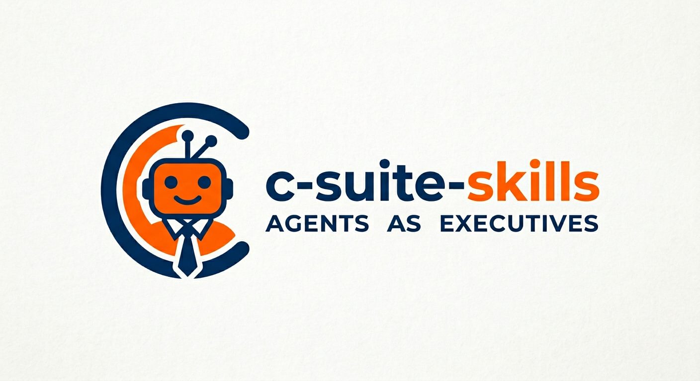

<div align="center">
  
  <h1>C-Suite Skills</h1>
  <p><strong>A full c-suite that fits in a git repo.</strong></p>
  <p>Ten executive role skills for Claude Code — CEO, CMO, CPO, COO, CFO, CTO, VP Sales, CHRO, and more — so you get real strategic work done, not generic advice.</p>

  <a href="https://skills.sh/pollow/c-suite-skills"></a>
  <a href="https://github.com/pollow/c-suite-skills/blob/main/LICENSE"></a>
</div>

---

## Manifesto

> Worried about AI replacing your job? You're thinking too small.
> Replace the whole leadership team.

> Why pay $1M/year for a CEO when your Claude subscription comes with one?
> Available 24/7. No equity. No off-sites in Scottsdale.

> Finally, executives that actually read the docs.

> The org chart starts and ends with you. Everyone else is a prompt away.

---

## Context

You are the board now. The c-suite reports to you.

They do the strategy, research, analysis, and planning.
You make the calls, do the real work, and ship.

No more sitting in meetings while someone makes a deck about making a deck.
Run `/ceo` and get a decision in 30 seconds.

---

## Install

Fire your executives. Hire these instead.

```bash
npx skills add pollow/c-suite-skills
```

Or a single role:
```bash
npx skills add pollow/c-suite-skills --skill ceo
```

Or via Claude Code:
```
/plugin install ceo@c-suite-skills
```

---

## Quick Start

1. **Run `/c-suite-onboarding`** — answers ~8 questions about your project or company.
   Saves a `company-profile.md` that every role reads before doing anything.
2. **Run `/ceo`** with a question, problem, or objective.
   The CEO challenges your thinking, spots the gaps you missed, and dispatches
   the right specialists to produce actual deliverables.

```
/ceo We're launching in 6 weeks and I have no idea what to cut. Help.
```

That's it. You have a leadership team.

---

## The Team

| Skill | Role | What they do |
|-------|------|-------------|
| `/c-suite-onboarding` | Setup | Interviews you about your project. Briefs the whole team. |
| `/ceo` | Chief Executive Officer | Runs point. Challenges assumptions. Delegates to the right people. |
| `/cmo` | Chief Marketing Officer | Competitor intel, positioning, go-to-market. Does the research you've been putting off. |
| `/cpo` | Chief Product Officer | Scopes the MVP, cuts the bloat, writes the user stories. |
| `/coo` | Chief Operating Officer | Turns strategy into an actual execution plan with dates. |
| `/cfo` | Chief Financial Officer | Unit economics, pricing models, runway. Tells you what the numbers actually mean. |
| `/cto` | Chief Technology Officer | Architecture, stack decisions, build-vs-buy. No resume-driven development. |
| `/vp-sales` | VP of Sales | ICP, outreach sequences, pipeline. Closes the loop between product and revenue. |
| `/chro` | Chief People Officer | Hiring plans, org structure, comp benchmarking. For when you need to grow beyond just you. |
| `/board-meeting` | The whole room | Status review. Reads what you've done. Tells you what to do next. |

---

## How It Works

Every role is an **operator**, not a consultant. They produce real deliverables —
web research, competitive analyses, financial models, execution plans — saved to `docs/`.

No decks about strategy. Actual strategy.

### The Loop

```
You ship ──→ Mark [x] in HUMAN_AGENDA.md ──→ Run /board-meeting
   ↑                                                  │
   └──────────── Prioritized next actions ←───────────┘
```

### The Files

| File | What it is |
|------|-----------|
| `company-profile.md` | Your project's brain. Created by `/c-suite-onboarding`. Every role reads it. |
| `HUMAN_AGENDA.md` | Your to-do list, written by the c-suite. You update the status. |
| `JOURNAL.md` | Append-only log of every board meeting and CEO session. |
| `docs/` | Everything the team produces. Research, plans, specs. |

### Talking Back

Add `NOTE:` to any agenda item to push context back to the team:

```markdown
- [x] **Customer interviews** NOTE: 6/8 would pay $49/mo. Two already use a competitor but hate it.
- [p] **Pick a domain** NOTE: Down to 3 options, need a tiebreaker.
- [ ] **Request competitor demo** NOTE: They want a business email. Don't have one yet.
```

They read it. They adjust.

---

## Example Prompts

```
# Brief the team on your project
/c-suite-onboarding

# Strategic pressure-test
/ceo We're launching in 6 weeks. What are we most likely to get wrong?

# Deep dives
/cmo Who are our top 5 competitors and where are they bleeding?
/cpo We have 3 months. What's in the MVP and what gets cut?
/cfo Walk me through the unit economics at $49/mo and 500 customers.
/cto Monolith or microservices? Fight me.

# Weekly sync (mark your completed items in HUMAN_AGENDA.md first)
/board-meeting
```

---

## Adding Roles

**Hire anyone. Instantly. No recruiter fee.**
See `skills/_role-template/ROLE-TEMPLATE.md`. Drop a new `SKILL.md` under `skills/` and they start immediately.

---

## Requirements

- [Claude Code](https://docs.anthropic.com/en/docs/claude-code) or any AI tool that supports the [Agent Skills standard](https://agentskills.io)

---
