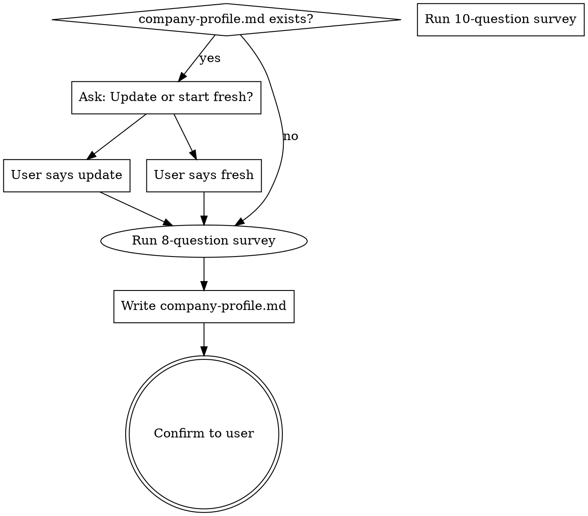

# C-Suite Onboarding

## Overview

Guided survey that captures what the founder actually knows about their business. Writes a structured `company-profile.md` that all c-suite skills read on load.

**Core principle:** Record facts from the founder. Never fabricate, assume, or fill in gaps with plausible-sounding guesses. If the founder doesn't know something, record "Not yet determined" — that gap itself is valuable signal for the c-suite.

## When to Use

- No `company-profile.md` exists in the project root
- User says they want to update or redo their company profile
- Another c-suite skill detects the profile is missing and invokes this

## Process



## Survey Questions

Ask **one question at a time** using the AskUserQuestion tool. Do NOT batch questions.

### Question 1: Business Category

```
header: "Category"
question: "What type of business are you building?"
options:
  - label: "SaaS / Software"
    description: "Software product sold as a subscription or license"
  - label: "E-commerce / DTC"
    description: "Selling physical or digital products directly to consumers"
  - label: "Services / Consulting"
    description: "Client-based work — agencies, freelancing, consulting"
  - label: "Marketplace"
    description: "Connecting buyers and sellers, taking a cut"
```
User can also select "Other" and type their own.

### Question 2: Business Stage

```
header: "Stage"
question: "What stage is your business at?"
options:
  - label: "Idea / Pre-revenue"
    description: "No paying customers yet"
  - label: "Early revenue (< $1M ARR)"
    description: "Some customers, finding product-market fit"
  - label: "Growth ($1M - $10M ARR)"
    description: "Product-market fit found, scaling"
  - label: "Scale ($10M+ ARR)"
    description: "Established business, optimizing"
```

### Question 3: Revenue Model

```
header: "Revenue"
question: "How does (or will) your business make money?"
options:
  - label: "Subscription"
    description: "Recurring monthly or annual payments"
  - label: "One-time sales"
    description: "Single purchase per transaction"
  - label: "Freemium"
    description: "Free tier with paid upgrades"
  - label: "Usage-based"
    description: "Pay per use, API calls, transactions, etc."
```

### Question 4: Team Size

```
header: "Team"
question: "How many people are on your team?"
options:
  - label: "Solo"
    description: "Just you"
  - label: "2-5"
    description: "Small founding team"
  - label: "6-20"
    description: "Early team with some specialization"
  - label: "21-50"
    description: "Growing organization"
```

### Question 5: Core Product/Service

```
header: "Product"
question: "Describe your core product or service. What does it do and who is it for?"
```
This is a free-form question — use AskUserQuestion with no options (user types freely via "Other").

Provide two options to guide them:
```
options:
  - label: "Let me describe it"
    description: "I'll type a description of my product/service"
```
The user will select "Other" and type their description, or select the option and elaborate.

### Question 6: Key Challenges

```
header: "Challenges"
question: "What are your biggest challenges right now? Select all that apply."
multiSelect: true
options:
  - label: "Product-market fit"
    description: "Figuring out if people want what you're building"
  - label: "Customer acquisition"
    description: "Getting users/customers"
  - label: "Fundraising"
    description: "Raising capital"
  - label: "Hiring"
    description: "Finding and retaining talent"
  - label: "Profitability"
    description: "Making the numbers work"
  - label: "Scaling operations"
    description: "Systems and processes breaking as you grow"
  - label: "Competition"
    description: "Competing against established players"
```

### Question 7: Long-Term Vision

```
header: "Vision"
question: "What is your long-term vision? Where does this business ultimately go?"
```
Free-form. Provide one guiding option:
```
options:
  - label: "Let me describe my vision"
    description: "I'll share where I see this business in 3-5+ years"
```

### Question 8: 3-Month Objectives

```
header: "Objectives"
question: "What are your concrete objectives for the next 3 months?"
```
Free-form. Provide one guiding option:
```
options:
  - label: "Let me list my objectives"
    description: "I'll describe what I want to achieve in the next quarter"
```

### Question 9: Founder Status

```
header: "Your Status"
question: "What's your current primary situation?"
options:
  - label: "Employed full-time elsewhere"
    description: "Working at another company while building this"
  - label: "Dedicated founder"
    description: "Full-time on this project"
  - label: "Student"
    description: "In school while building this"
  - label: "Freelance / Consulting"
    description: "Independent contractor; this is a side or primary project"
```
User can also select "Other" and describe their situation.

### Question 10: Location

```
header: "Location"
question: "Where are you based? Country and state/region — this shapes legal and compliance context."
options:
  - label: "Let me specify"
    description: "I'll type my country and state/region"
  - label: "Skip for now"
    description: "I'll add this to company-profile.md manually later"
```

## Writing company-profile.md

After all 10 questions, write the profile to `company-profile.md` in the project root using this exact template. Only include what the founder actually said. Mark anything not provided as "Not yet determined."

```markdown
# Company Profile

> Generated by c-suite-onboarding. This file is read by all c-suite skills.
> Last updated: [DATE]

## Business Overview

| Field | Details |
|-------|---------|
| **Category** | [from Q1] |
| **Stage** | [from Q2] |
| **Revenue Model** | [from Q3] |
| **Team Size** | [from Q4] |

## Founder Context

| Field | Details |
|-------|---------|
| **Status** | [from Q9] |
| **Location** | [from Q10] |

> Roles: use status and location to infer relevant constraints — IP ownership risks, applicable compliance (GDPR, CCPA, COPPA), tax implications, employer agreements. Do not apply a fixed checklist; reason from what's actually here.

## Product / Service

[from Q5 — founder's own words, lightly formatted]

## Key Challenges

[from Q6 — bulleted list]

## Long-Term Vision

[from Q7 — founder's own words]

## 3-Month Objectives

[from Q8 — founder's own words, formatted as a list if appropriate]
```

**Rules for writing the profile:**
- Use the founder's own words. Do not rephrase, elaborate, or "improve" their answers.
- Do NOT add sections the founder didn't provide information for (no market sizing, no competitive analysis, no financial projections).
- Do NOT fabricate or assume anything. If information is missing, it's missing.
- Keep it concise. This is a reference document, not a business plan.

## After Writing

Tell the user: "Company profile saved to company-profile.md. You can update it anytime by invoking this skill again."
